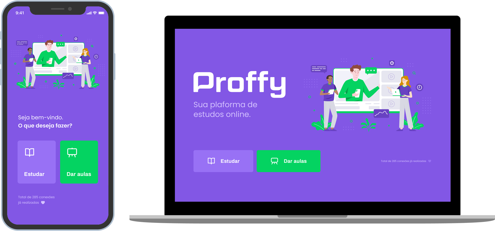
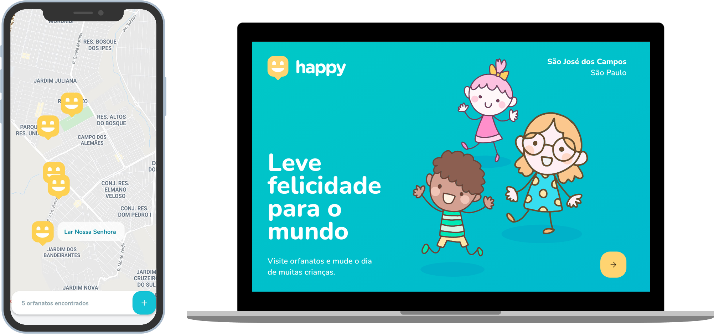
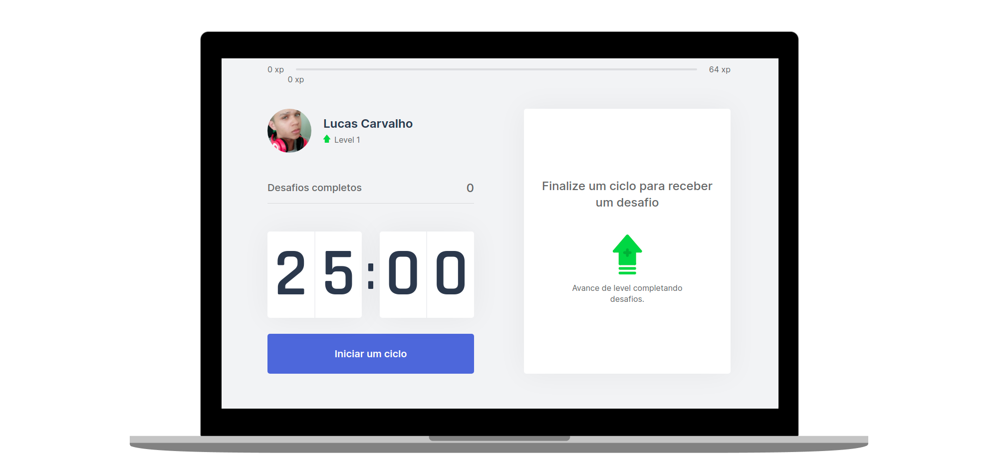

# Next Level Week
Repositório para os Projetos da Next Level Week (NLW) oferecidos pela [Rocketseat](https://rocketseat.com.br/).
## [NLW #01](https://github.com/Lucas-HMSC/next-level-week/tree/main/nlw-1)

    

    

### Sobre o Projeto
O Ecoleta é um marketplace que ajuda pessoas a encontrarem pontos de coleta de resíduos de forma eficiente.

### Tecnologias

## [NLW #02](https://github.com/Lucas-HMSC/next-level-week/tree/main/nlw-2)

    

    

### Sobre o Projeto
O Proffy é uma plataforma de estudos online que ajuda pessoas a encontrarem professores online.

### Tecnologias

## [NLW #03](https://github.com/Lucas-HMSC/next-level-week/tree/main/nlw-3)

    

    

### Sobre o Projeto
O Happy é uma aplicação que conecta pessoas à casas de acolhimento institucional para fazer o dia de muitas crianças mais feliz.

### Tecnologias

## [NLW #04 - Trilha ReactJS](https://github.com/Lucas-HMSC/next-level-week/tree/main/nlw-4/moveit-next)

    

    

### Sobre o Projeto
O move.it é um app que une a técnica de Pomodoro com a realização de exercícios físicos para quem passa muito tempo na frente do computador.

### Tecnologias

## NLW #05
Em breve.
