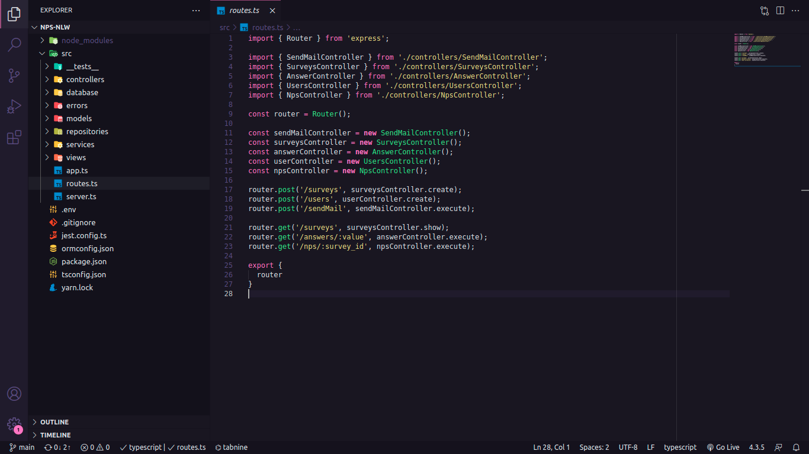
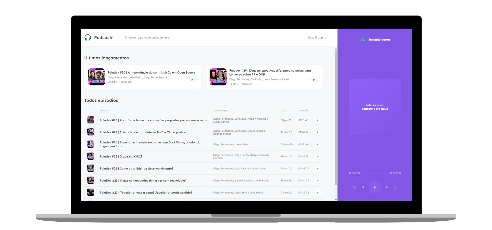
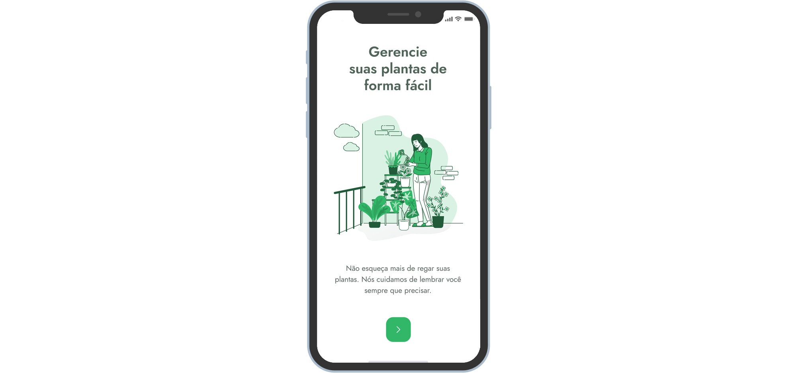
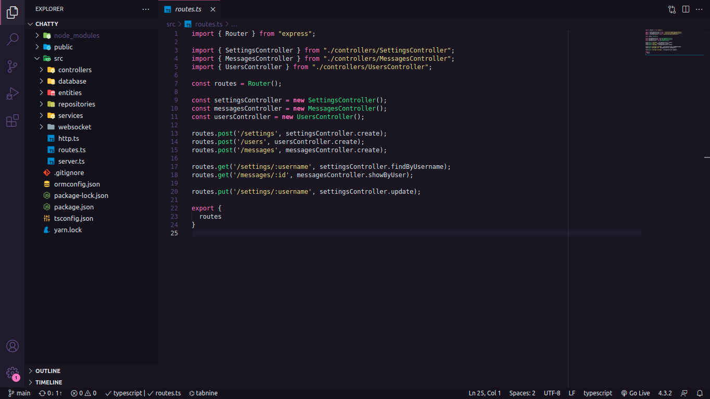
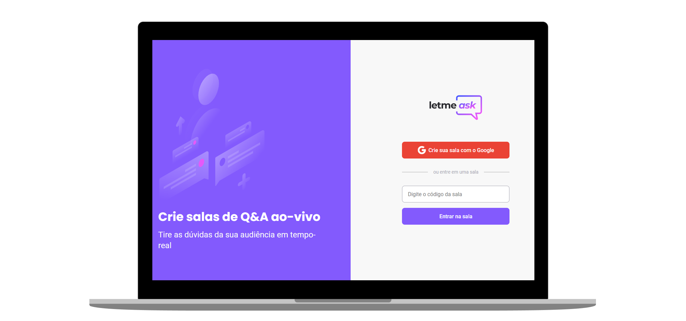
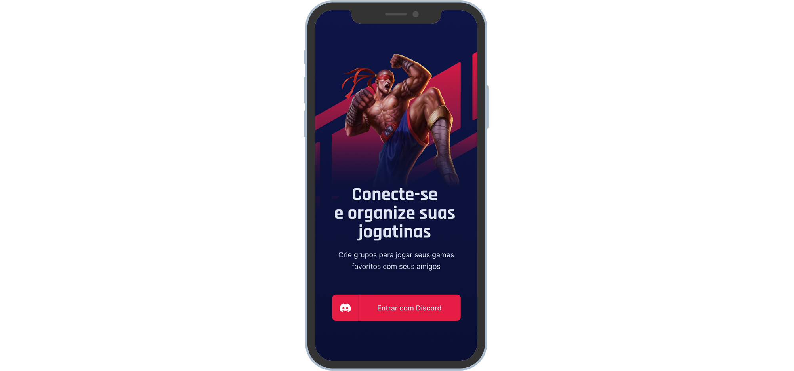
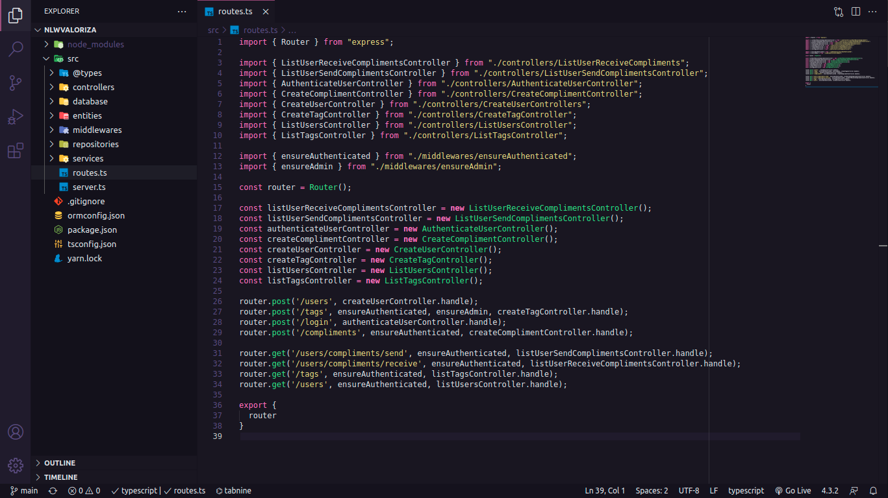
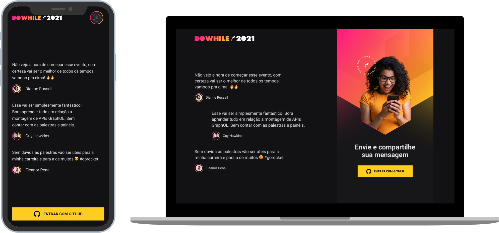
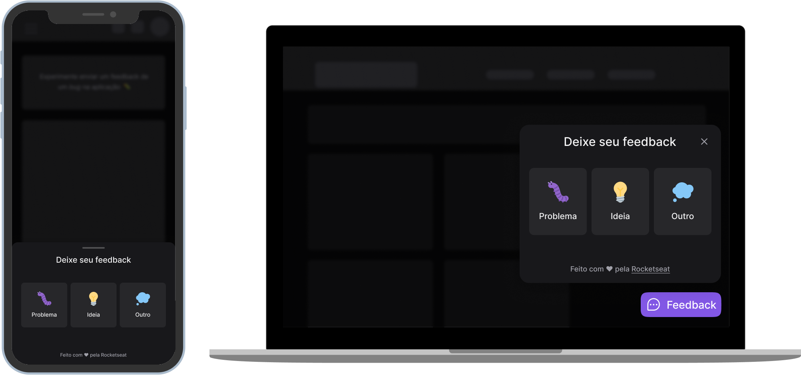

# Next Level Week
Repositório para os Projetos da Next Level Week (NLW) oferecidos pela [Rocketseat](https://rocketseat.com.br/).

## [NLW #01 - Trilha OmniStack](https://github.com/Lucas-HMSC/next-level-week/tree/main/nlw-1)

    

    

### Sobre o Projeto
O Ecoleta é um marketplace que ajuda pessoas a encontrarem pontos de coleta de resíduos de forma eficiente.

### Tecnologias

## [NLW #02 - Trilha OmniStack](https://github.com/Lucas-HMSC/next-level-week/tree/main/nlw-2)

    

    

### Sobre o Projeto
O Proffy é uma plataforma de estudos online que ajuda pessoas a encontrarem professores online.

### Tecnologias

## [NLW #03 - Trilha OmniStack](https://github.com/Lucas-HMSC/next-level-week/tree/main/nlw-3)

    

    

### Sobre o Projeto
O Happy é uma aplicação que conecta pessoas à casas de acolhimento institucional para fazer o dia de muitas crianças mais feliz.

### Tecnologias

## [NLW #04 - Trilha ReactJS](https://github.com/Lucas-HMSC/next-level-week/tree/main/nlw-4/moveit-next)

    

    

### Sobre o Projeto
O move.it é um app que une a técnica de Pomodoro com a realização de exercícios físicos para quem passa muito tempo na frente do computador.

### Tecnologias

## [NLW #04 - Trilha NodeJS](https://github.com/Lucas-HMSC/next-level-week/tree/main/nlw-4/nps-nlw)

    

### Sobre o Projeto
O NPS-NLW é uma aplicação que consiste em calcular o NPS (Net Promoter Score) da empresa.

### Tecnologias

## [NLW #05 - Trilha ReactJS](https://github.com/Lucas-HMSC/next-level-week/tree/main/nlw-5/podcastr)

    

    

### Sobre o Projeto
O podcastr é um app para reprodução de episódios em áudio do seu podcast favorito.

### Tecnologias

## [NLW #05 - Trilha React Native](https://github.com/Lucas-HMSC/next-level-week/tree/main/nlw-5/plantmanager)

    

    

### Sobre o Projeto
Aplicativo para lhe ajudar a lembrar de cuidar de suas plantas de forma fácil de acordo com cada tipo de plantinha.

### Tecnologias

## [NLW #05 - Trilha NodeJS](https://github.com/Lucas-HMSC/next-level-week/tree/main/nlw-5/chatty)

    

### Sobre o Projeto
O Chatty é um chat para atendimento de clientes em tempo real.

### Tecnologias

## [NLW #06 - Trilha ReactJS](https://github.com/Lucas-HMSC/next-level-week/tree/main/nlw-6/letmeask)

    

    

### Sobre o Projeto
Letmeask é perfeito para criadores de conteúdos poderem criar salas de Q&A com o seu público, de uma forma muito organizada e democrática.

### Tecnologias

## [NLW #06 - Trilha React Native](https://github.com/Lucas-HMSC/next-level-week/tree/main/nlw-6/gameplay)

    

    

### Sobre o Projeto
Aplicativo para lhe ajudar a conectar-se e organiza o momento de diversão e jogar com os amigos. Crie grupos para jogar seus games favoritos com seus amigos com esse App que possui autenticação com Discord.

### Tecnologias

## [NLW #06 - Trilha NodeJS](https://github.com/Lucas-HMSC/next-level-week/tree/main/nlw-6/nlwValoriza)

    

### Sobre o Projeto
Valoriza é uma plataforma para promover o reconhecimento entre companheiros de equipe.

### Tecnologias

## [NLW #07 - Trilha Impulse](https://github.com/Lucas-HMSC/next-level-week/tree/main/nlw-7)

    

    

### Sobre o Projeto
A NLW Heat é um projeto de aquecimento para o DoWhile 2021, com uma landing page onde os usuários pode se autenticar com o GitHub e enviar mensagens sobre o evento.

### Tecnologias

## [NLW #08 - Trilha Impulse](https://github.com/Lucas-HMSC/next-level-week/tree/main/nlw-8)

    

### Sobre o Projeto
O widget de Feedback é um projeto isolado, pensado para ser aplicado em qualquer website, com o intuito de proporcionar um espaço para que os usuários possam relatar suas opiniões à equipe gestora do website.

### Tecnologias

## Licensa 

Esse projeto está sob a licença MIT. Veja o arquivo [LICENSE](https://raw.githubusercontent.com/Lucas-HMSC/next-level-week/main/LICENSE) para mais detalhes.