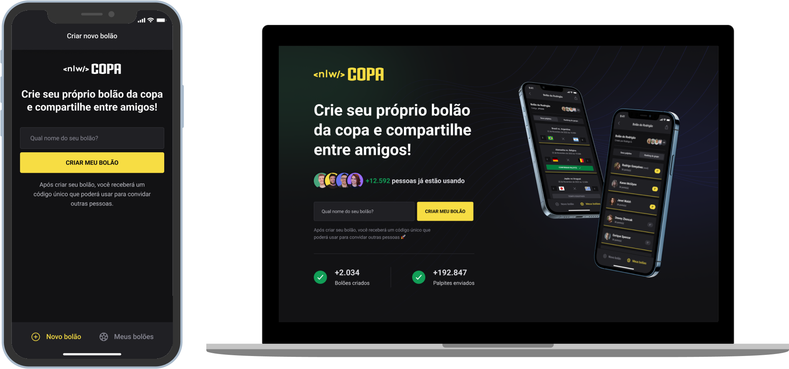

## NLW #10 - Trilha Ignite

    

### Sobre o Projeto
O NLW Copa é uma plataforma que permite aos usuários a criação de "bolões" e o seu compartilhamento para que outras pessoas possam entrar e enviarem os seus palpites dos jogos que acontecerão na Copa 2022. 

### Tecnologias

### Como executar

- Clone o repositório
- Acesse a pasta `server`, e instale as dependências com `yarn` ou `npm install`.
- Inicie o server com `npm start` ou `yarn start`.
- Para iniciar a aplicação Web, acesse a pasta `web` e instale as dependências com `yarn` ou `npm install`.
- Execute `npm run dev` ou `yarn dev`.
- Para iniciar a aplicação mobile, acesse a pasta `mobile` e instale as dependências com `yarn` ou `npm install`.
- Execute `npx expo start`.
