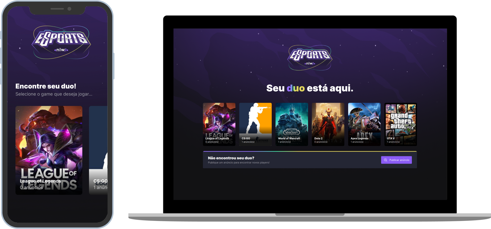

## NLW #09 - Trilha Impulse

    

### Sobre o Projeto
O eSports é um projeto com o intuito de facilitar o encontro de jogadores, exibindo uma lista de jogos cadastrados no banco de dados e para cada jogo é possível se cadastrar para ser encontrado e também visualizar os anúncios ja publicados. Na versão mobile (somente) é possível abrir mais informações sobre esses anúncios e obter o usuário do discord do jogador em questão.

### Tecnologias

### Como executar

- Clone o repositório
- Acesse a pasta `server`, e instale as dependências com `yarn` ou `npm install`.
- Inicie o server com `npm run dev` ou `yarn dev`.
- Para iniciar a aplicação Web, acesse a pasta `web` e instale as dependências com `yarn` ou `npm install`.
- Execute `npm run dev` ou `yarn dev`.
- Para iniciar a aplicação mobile, acesse a pasta `mobile` e instale as dependências com `yarn` ou `npm install`.
- Execute `expo start`.
